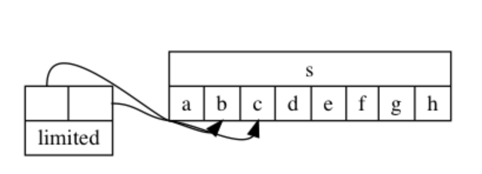

# Python Buffer Protocol 实现高性能编程

无论你程序是做什么的，它经常都需要处理大量的数据。这些数据大部分表现形式为strings（字符串）。然而，当你对字符串大批量的拷贝，切片和修改操作时是相当低效的。为什么？

让我们假设一个读取二进制数据的大文件示例，然后将部分数据拷贝到另外一个文件。要展示该程序所使用的内存，我们使用[memory_profiler](https://pypi.python.org/pypi/memory_profiler)，一个强大的Python包，让我们可以一行一行观察程序所使用的内存。

```python
@profile
def read_random():
    with open("/dev/urandom", "rb") as source:
        content = source.read(1024 * 10000)
        content_to_write = content[1024:]
    print(f"content length: {len(content)}, content to write length {len(content_to_write)}")
    with open("/dev/null", "wb") as target:
        target.write(content_to_write)


if __name__ == "__main__":
    read_random()

```

使用 memory_profiler 模块来执行以上程序，输出如下：

```
$ python -m memory_profiler example.py 
content length: 10240000, content to write length 10238976
Filename: example.py

Line #    Mem usage    Increment   Line Contents
================================================
     1   14.320 MiB   14.320 MiB   @profile
     2                             def read_random():
     3   14.320 MiB    0.000 MiB       with open("/dev/urandom", "rb") as source:
     4   24.117 MiB    9.797 MiB           content = source.read(1024 * 10000)
     5   33.914 MiB    9.797 MiB           content_to_write = content[1024:]
     6   33.914 MiB    0.000 MiB       print(f"content length: {len(content)}, content to write length {len(content_to_write)}")
     7   33.914 MiB    0.000 MiB       with open("/dev/null", "wb") as target:
     8   33.914 MiB    0.000 MiB           target.write(content_to_write)
```

我们通过 **source.read** 从 **/dev/unrandom** 加载了 10 MB 数据。Python 需要大概需要分配 10 MB 内存来以字符串存储这个数据。之后的 **content[1024:]** 指令越过开头的一个单位的 KB 数据进行数据拷贝，也分配了大概 10 MB。

这里有趣的是在哪里呢，也就是构建 **content_to_write** 时 10 MB 的程序内存增长。切片操作拷贝了除了开头的一个单位的KB其他所有的数据到一个新的字符串对象。

如果处理类似大量的字节数组对象操作那是简直就是灾难。如果你之前写过 C 语言，在使用 **memcpy()** 需要注意点是：在内存使用以及总体性能来说，复制内存很慢。

然而，作为 C 程序员的你，知道字符串其实就是由字符数组构成，你不非得通过拷贝也能只处理部分字符，通过使用基本的指针运算——只需要确保整个字符串是连续的内存区域。

在 Python 同样提供了 **buffer protocol** 实现。buffer protocol 定义在[PEP 3118](http://www.python.org/dev/peps/pep-3118/)，描述了使用 C 语言 API 实现各种类型的支持，例如字符串。

当一个对象实现了该协议，你就可以使用 **memoryview** 类构造一个 **memoryview** 对象引用原始内存对象。

```python
>>> s = b"abcdefgh"
>>> view = memoryview(s)
>>> view
<memory at 0x10adfaa08>
>>> bytes(view)
b'abcdefgh'
>>> view[1]
98
>>> limited = view[1:3]
>>> limited
<memory at 0x10adfaac8>
>>> bytes(view[1:3])
b'bc'
>>>
>>> bytes(limited)
b'bc'
>>>

```

> 注意：98 是字符 b 的 ACSII 码

在上面的例子中，在使用**memoryview**对象的切片操作，同样返回一个**memoryview**对象。意味着它并没有拷贝任何数据，而是通过引用部分数据实现的。

下面图示解释发生了什么：



因此，我们可以将之前的程序改造得更加高效。我们需要使用 **memoryview** 对象来引用数据，而不是开辟一个新的字符串。

```python
@profile
def read_random():
    with open("/dev/urandom", "rb") as source:
        content = source.read(1024 * 10000)
        content_to_write = memoryview(content)[1024:]
    print(f"content length: {len(content)}, content to write length {len(content_to_write)}")
    with open("/dev/null", "wb") as target:
        target.write(content_to_write)


if __name__ == "__main__":
    read_random()
```

我们再一次使用 memory profiler 执行上面程序：

```
$ python -m memory_profiler example.py 
content length: 10240000, content to write length 10238976
Filename: example.py

Line #    Mem usage    Increment   Line Contents
================================================
     1   14.219 MiB   14.219 MiB   @profile
     2                             def read_random():
     3   14.219 MiB    0.000 MiB       with open("/dev/urandom", "rb") as source:
     4   24.016 MiB    9.797 MiB           content = source.read(1024 * 10000)
     5   24.016 MiB    0.000 MiB           content_to_write = memoryview(content)[1024:]
     6   24.016 MiB    0.000 MiB       print(f"content length: {len(content)}, content to write length {len(content_to_write)}")
     7   24.016 MiB    0.000 MiB       with open("/dev/null", "wb") as target:
     8   24.016 MiB    0.000 MiB           target.write(content_to_write)
```

在该程序中，**source.read** 仍然分配了 10 MB 内存来读取文件内容。然而，使用 memoryview 来引用部分内容时，并没有额外在分配内存。

相比之前的版本，这里节省了大概 50% 的内存开销。

该技巧，在处理 sockets 通信的时候极其有用。当通过 socket 发送数据时，所有的数据可能并没有在一次调用就发送。

```python
import socket
s = socket.socket(…)
s.connect(…)
# Build a bytes object with more than 100 millions times the letter `a`
data = b"a" * (1024 * 100000)
while data:
    sent = s.send(data)
    # Remove the first `sent` bytes sent
    data = data[sent:]
```

使用如下实现，程序一次次拷贝直到所有的数据发出。通过使用 **memoryview** 方式来完成该工作，具有更高的性能：

```python
import socket
s = socket.socket(…)
s.connect(…)
# Build a bytes object with more than 100 millions times the letter `a`
data = b"a" * (1024 * 100000)
mv = memoryview(data)
while mv:
    sent = s.send(mv)
    # Build a new memoryview object pointing to the data which remains to be sent
    mv = mv[sent:]
```

在这里就不会发生任何拷贝，也不会在给 **data** 分配了 100 MB 内存之后再分配多余的内存来进行多次发送了。

目前，我们通过使用 **memoryview** 对象实现高效数据写入，但在某些情况下读取也同样适用。在 Python 中大部分 I/O 操作已经实现了 buffer protocol 机制。在本例中，我们并不需要 **memoryview** 对象，我可以请求 I/O 函数写入我们预定义好的对象：

```python
>>> ba = bytearray(8)
>>> ba
bytearray(b'\x00\x00\x00\x00\x00\x00\x00\x00')
>>> with open("/dev/urandom", "rb") as source:
...     source.readinto(ba)
...
8
>>> ba
bytearray(b'\x9dPv\xe9$\xd8\xb5?')
>>>
```

通过该机制，我们可以很简单写入到预定义的 buffer 中（在 C 语言中，你可能需要多次调用 **malloc()** )。

适用 **memoryview**，你甚至可以将数据放入到内存区域任意点：

```python
>>> ba = bytearray(8)
>>> ba_at_4 = memoryview(ba)[4:]
>>> with open("/dev/urandom", "rb") as source:
...     source.readinto(ba_at_4)
...
4
>>> ba
bytearray(b'\x00\x00\x00\x00\x11n]\x15')
>>>
```

buffer protocol 是实现低内存开销的基础，具备很强的性能。虽然 Python 隐藏了所有的内存分配，开发者不需要关系内部是怎么样实现的。

可以再去了解一下 **array** 模块和 **struct** 模块是如何处理 buffer protocol 的。

* memoryview
* struct
* array
* bytearray

https://www.cnblogs.com/erhuabushuo/p/10314803.html
