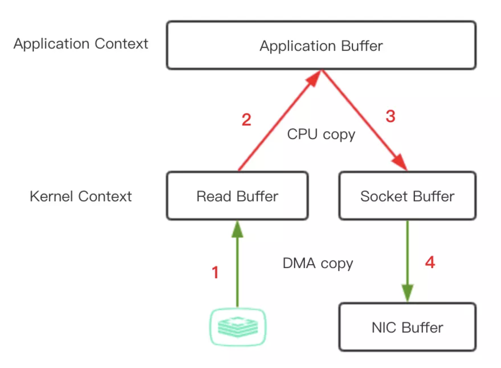
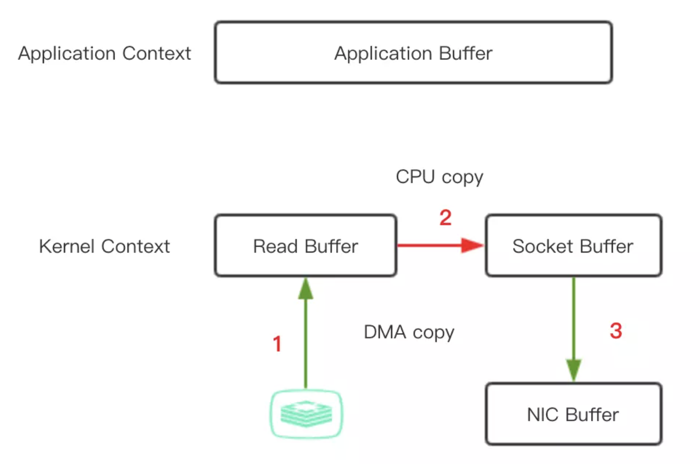
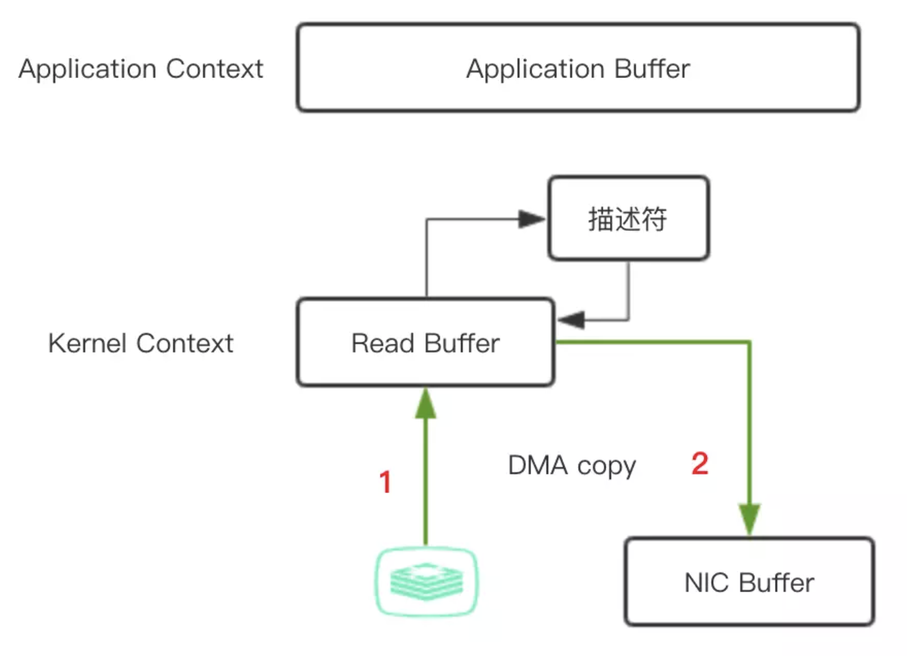

# Zero Copy

实现以下这个场景：从一个文件中读出数据并将数据传到另一台服务器上？

伪代码如下：

```
File.read(file, buf, len)
Socket.send(socket, buf, len)
```

这种方式一共涉及了4次数据拷贝，如下图所示：



1. 应用程序中调用 `read()` 方法，这里会涉及到一次**上下文切换（用户态 -> 内核态）**，底层采用 DMA（direct memory access）读取磁盘的文件，并**把内容存储到内核地址空间的读取缓存区**。

2. 由于应用程序无法读取内核地址空间的数据，如果应用程序要操作这些数据，必须把这些内容从读取缓冲区拷贝到用户缓冲区。这个时候 `read()` 调用返回，且引发一次**上下文切换（内核态 ->用户态）**，现在**数据已经被拷贝到了用户地址空间缓冲区**，这时，如果有需要，应用程序可以操作修改这些内容。

3. 我们最终目的是把这个文件内容通过 Socket 传到另一个服务中，调用 Socket 的 `send()` 方法，这里又涉及到一次**上下文切换（用户态 -> 内核态）**，同时，文件内容被进行第三次拷贝，被**再次拷贝到内核地址空间缓冲区**，但是这次的缓冲区与目标套接字相关联，与读取缓冲区没有半点关系。

4. `send()` 调用返回，引发第四次的**上下文切换（内核态 ->用户态）**，同时进行**第四次的数据拷贝**，通过 DMA 把数据从目标套接字相关的缓存区传到协议引擎进行发送。

在整个过程中，过程 1 和 4 是由 DMA 负责，并不会消耗 CPU，只有过程 2 和 3 的拷贝需要 CPU 参与。

如果在应用程序中，不需要操作内容，过程 2 和 3 就是多余的，如果可以直接把内核态读取缓存冲区数据直接拷贝到套接字相关的缓存区，是不是可以达到优化的目的？



这种实现，可以有以下几点改进：

- 上下文切换的次数从四次减少到了两次

- 数据拷贝次数从四次减少到了三次（其中 DMA copy 2 次，CPU copy 1 次）

在 Java 中，`FileChannel` 对象的 `transferTo()` 方法可以实现这个过程，该方法将数据从文件通道传输到给定的可写字节通道， 上面的 `file.read()` 和 `socket.send()` 调用动作可以替换为 `transferTo()` 调用

```
public void transferTo(long position, long count, WritableByteChannel target)
```

在 UNIX 和各种 Linux 系统中，此调用被传递到 `sendfile()` 系统调用中，最终实现将数据从一个文件描述符传输到了另一个文件描述符。

确实改善了很多，但还没达到零拷贝的要求。

如果底层网络接口卡支持收集操作的话，就可以进一步的优化。

在 Linux 内核 2.4 及后期版本中，针对套接字缓冲区描述符做了相应调整，DMA 自带了收集功能，对于用户方面，用法还是一样的，但是内部操作已经发生了改变：



1. 第一步，`transferTo()` 方法引发 DMA 将文件内容拷贝到内核读取缓冲区。

2. 第二步，把包含数据位置和长度信息的描述符追加到套接字缓冲区，避免了内容整体的拷贝，DMA 引擎直接把数据从内核缓冲区传到协议引擎，从而消除了最后一次 CPU 参与的拷贝动作。

* [参考](https://www.jianshu.com/p/2581342317ce)

